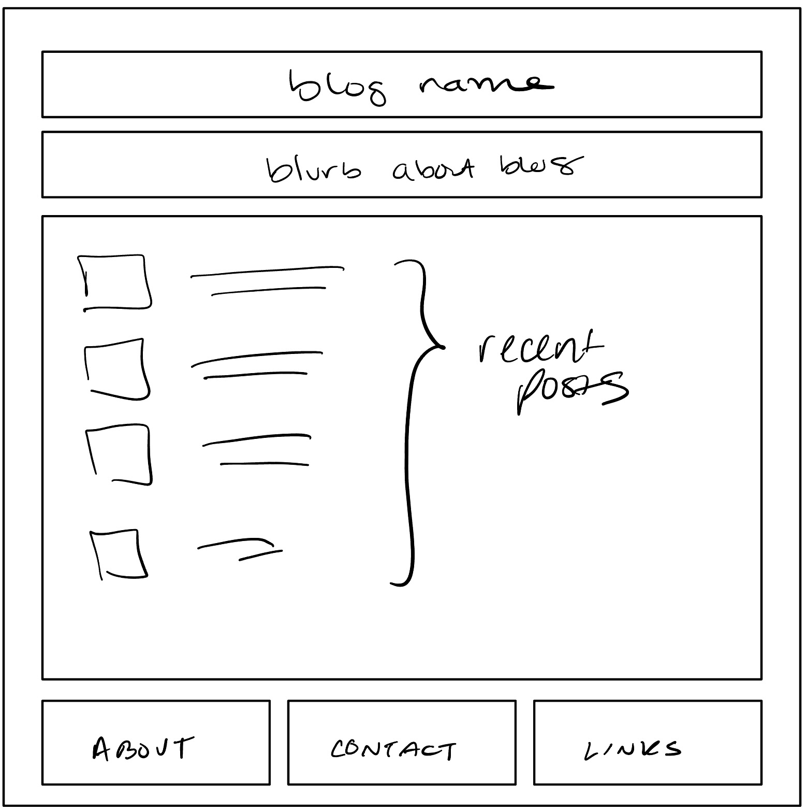
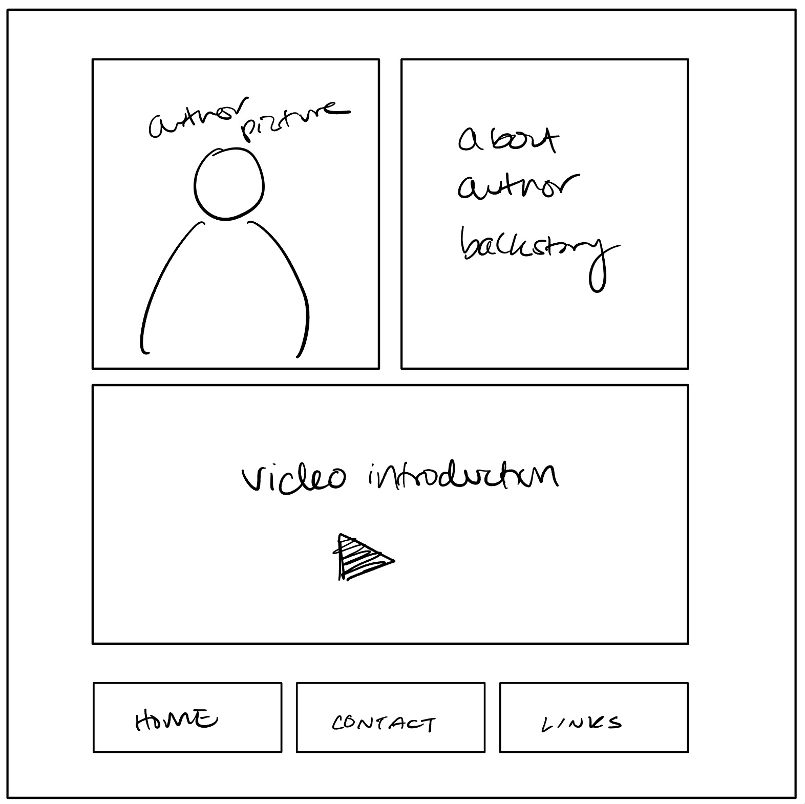
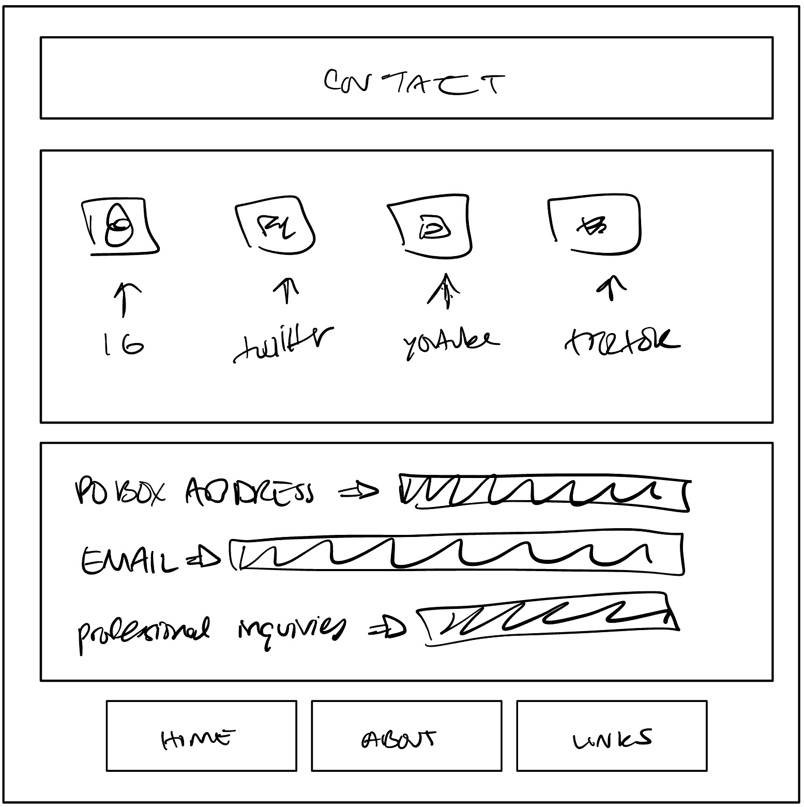

# Michele Sandhu's INF6420 Project

A blog filled with short stories and real life annecdotes.

## wireframes

Header - this will include name of the blog as well as an introduction blurb

Navigation Menu - this will include links to other pages such as contact and about me

Main Content - this will feature the most recent blog entries as well as the most popular and current trending ones

Footer - this will include copyright information 

Header - this will include author name

Navigation Menu - this will include links to other pages including  back to home page

Main Content - this will feature a profile picture as well as background information and a video introduction

Footer - this will include copyright information

Header - this will include the header saying contact page

Navigation Menu - this will include links to other pages

Main Content - this will include links to all social media platforms as well as a PO box address and an email address

Footer - this will include copyright information